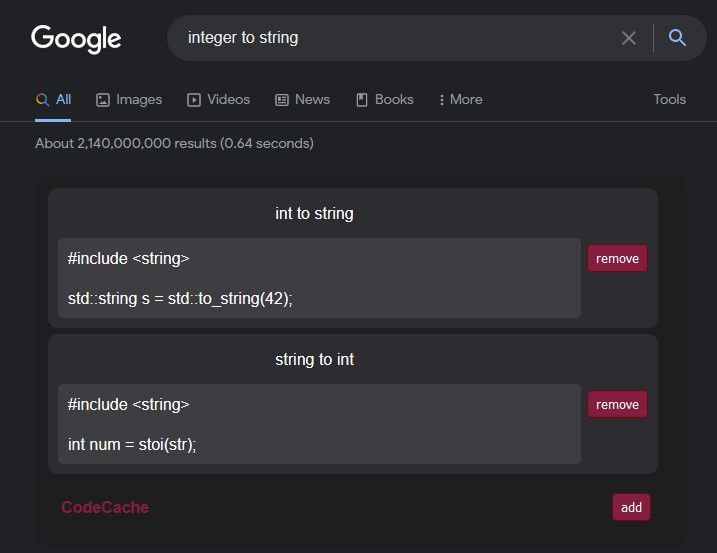

# CodeCache



A firefox addon for faster, easier google searching.

### Our motivation

Listen. Remembering how to use ```atoi``` and ```stoi``` is just not something we can do. But going through 10 stackoverflow answers everytime we need to convert int to string is mad annoying. Hence CodeCache.

### How it works - the addon

Do a google search $\rightarrow$ find a fitting answer $\rightarrow$ save your answer to CodeCache addon $\rightarrow$ next time you're searching CodeCache will display your answer at the top of search results.

CodeCache displays answers for queries similar to the one provided. They are sorted by resemblance and top 5 are displayed.

### How it works - the server

//TODO

### How it works - the API

You can create your own frontend. It needn't even be an addon $:)$
The server responds to all the following, with a json containing top 5 answers for a given query.


- getting answers: "http://" + HOST + "/search?q=" + query
- adding an answer: "http://" + HOST + "/add", {
                                    method: 'POST',
                                    body: JSON.stringify({"question": query, "text": ans})
                                }
- removing an answer: "http://" + HOST + "/delete", {
                                      method: 'POST',
                                      body: JSON.stringify({"question": query, "questionId" : qId, "text": ans, "textId": aId})
                                  }

Response JSON example:
``` json
{
"answers" : [
{ "question": "czemu", "questionId": 158, "text": "jeszcze nie", "textId": 8 },
{ "question": "czemu nei", "questionId": 153, "text": "2", "textId": 2 },
{ "question": "czemu tak", "questionId": 155, "text": "4", "textId": 4 },
{ "question": "czemu am", "questionId": 157, "text": "6", "textId": 6 },
{ "question": "czemu tak jest", "questionId": 152, "text": "1", "textId": 1 }
]
}
```